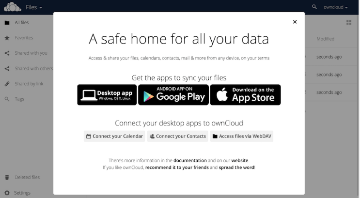
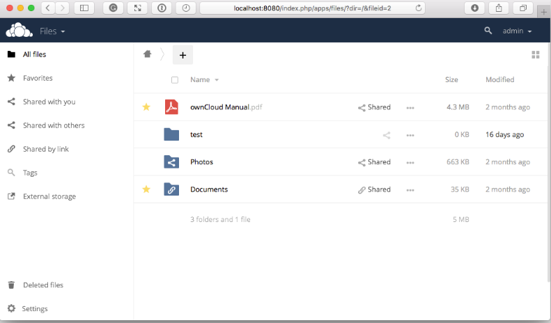
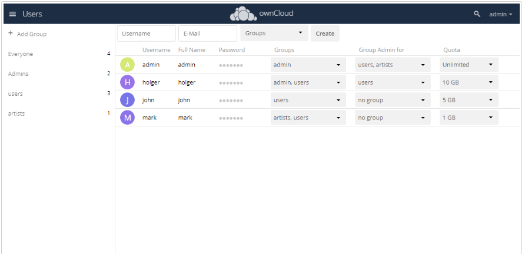
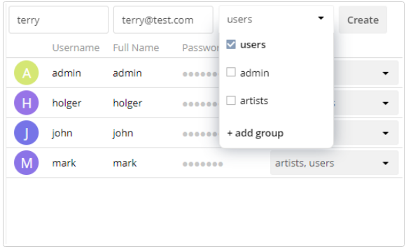

[](https://reni-tom.github.io/ownCloud/)

# Configure your ownCloud

After installing ownCloud successfully, it is recommended to perform some post-installation tasks to increase performance.

## Configure Trusted Domains

```
myip=$(hostname -I|cut -f1 -d ' ')
occ config:system:set trusted_domains 1 --value="$myip"
```

## Set Up a Cron Job

```occ background:cron
echo "*/15  *  *  *  * /var/www/owncloud/occ system:cron" \
  > /var/spool/cron/crontabs/www-data
chown www-data.crontab /var/spool/cron/crontabs/www-data
chmod 0600 /var/spool/cron/crontabs/www-data
```

> **Note:**
>
> If you need to sync your users from an LDAP or Active Directory Server, add this additional Cron job. 
>Every 15 minutes this cron job will sync LDAP users in ownCloud and disable the ones who are not available for ownCloud. 
>In addition, you get a log file in /var/log/ldap-sync/user-sync.log for debugging.
>
>```
>echo "*/15 * * * * /var/www/owncloud/occ user:sync 'OCA\User_LDAP\User_Proxy' -m disable -vvv >> /var/log/ldap-sync/user-sync.log 2>&1" > /var/spool/cron/crontabs/www-data
>chown www-data.crontab  /var/spool/cron/crontabs/www-data
>chmod 0600  /var/spool/cron/crontabs/www-data
>mkdir -p /var/log/ldap-sync
>touch /var/log/ldap-sync/user-sync.log
>chown www-data. /var/log/ldap-sync/user-sync.log
>```

## Configure Caching and File Locking

```occ config:system:set \
   memcache.local \
   --value '\OC\Memcache\APCu'
occ config:system:set \
   memcache.locking \
   --value '\OC\Memcache\Redis'
occ config:system:set \
   redis \
   --value '{"host": "127.0.0.1", "port": "6379"}' \
   --type json
```

## Configure Log Rotation

```FILE="/etc/logrotate.d/owncloud"
sudo /bin/cat <<EOM >$FILE
/var/www/owncloud/data/owncloud.log {
  size 10M
  rotate 12
  copytruncate
  missingok
  compress
  compresscmd /bin/gzip
}
EOM
```

Ensure that the permissions are correct:

```
cd /var/www/
chown -R www-data. owncloud
```
Open your web browser, type your server IP address followed by /owncloud. 
For example, http://server-ip/owncloud
Now, your ownCloud is ready to use.
A welcome screen with a download link to the ownCloud Android apps and desktop client in the Google Play Store appears.



You can change also change your ownCloud URL in your webserver configuration.

## Change your ownCloud URL

To change URL on Debian/Ubuntu Linux, edit the following files:
- /etc/apache2/sites-enabled/owncloud.conf
- /var/www/owncloud/config/config.php

Edit the Alias directive in /etc/apache2/sites-enabled/owncloud.conf to alias your ownCloud directory to the Web server root:

```
Alias / "/var/www/owncloud/"
```

Edit the overwrite.cli.url parameter in /var/www/owncloud/config/config.php:
```
'overwrite.cli.url' => 'http://localhost/',
```

After editing the files, save them, and restart Apache.

> **Note:**
>
> You cannot run any other virtual hosts, as ownCloud is aliased to your web root.

You can access your ownCloud from https://localhost/ and port number 8080, which is the default port number.



Now, you can configure the user configuration on your ownCloud such as user roles, authentication, groups, and so on. 

## Create User

Log in to your ownCloud account using the web browser.
**A safe home for all your data** dialog appears.
Close the dialog to access the main user interface. 

The default view displays your basic user information.



To create a user account:
1.	Enter a user name and **E-Mail**.
2.	If required, you can assign **Groups**.
3.	Click **Create**.



