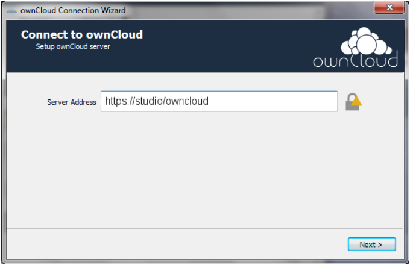
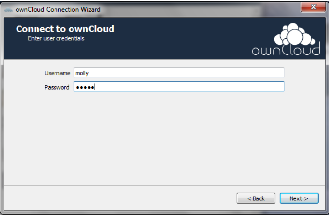
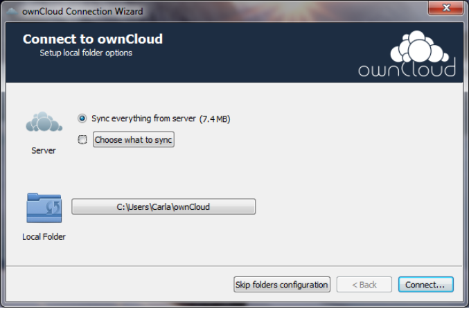
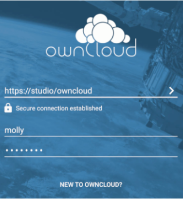
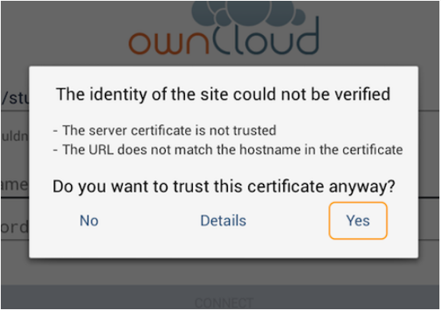
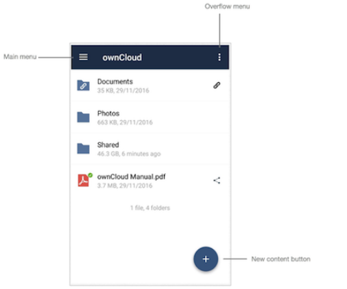

# Connect to your ownCloud Server

You can synchronize the files in your local shared directories to the server and other devices. Synchronize the files in your local shared directories to the server and other devices using your ownCloud. 
You can connect to your ownCloud server using any Web browser or you can also use any of the following:
- [ownCloud Desktop Synchronization Client](#owncloud-desktop-synchronization-client)
- [ownCloud Mobile App](#owncloud-mobile-app)

## ownCloud Desktop Synchronization Client
You can download the latest version of the ownCloud Desktop Synchronization Client from the [ownCloud download page](https://owncloud.com/download-server/#desktop-clients) on Linux, macOS, and Microsoft Windows.
For Linux, you must follow the instructions on the download page to add the appropriate repository for the Linux distribution, install the signing key, and then use their package managers to install the desktop sync client.
For Mac OS X and Windows, download, launch the installation, and follow the installation wizard.

After installing the desktop sync client, the installation wizard takes you through the configuration options and account setup. 
To configure your account on the desktop sync client, perform the following:
1. Enter the URL of your ownCloud server and click Next.
    
	
2. In the next screen that appears, enter your ownCloud credentials, and click **Next**.

    
3. In the **Setup local folder options** screen that appears, select **Sync everything from server**, or select individual folder.
    
	
	
	The default local sync folder is ownCloud, which is in your home directory. If you want, you can change the folder.
4. Click **Connect**.

    The client attempts to connect to your ownCloud server.

## ownCloud Mobile App
You can also access the files on your ownCloud server on a smartphone via an Android app or iOS app.

To use your ownCloud server on an Android device, download and install the ownCloud Android app from the Google Play store. 
Run your ownCloud Android app, it opens to a configuration screen. Enter your server URL, user name, password, and click Connect. 

For best security, it is recommended to connect via HTTPS.
The ownCloud Android app tests your connection as soon as you provide it. 
If your server has a self-signed SSL certificate, you’ll get a warning that it is not to be trusted. If this happens, click **YES** to accept the certificate, and complete your account setup.

Now, your ownCloud Android app is ready to use. 
In the ownCloud Android app screen that appears, click the main menu to manage the core functionalities:

Following are the core functionalities:
- [Manage Users Accounts](https://doc.owncloud.com/android/#manage-users-accounts)
- [Current Uploads](https://doc.owncloud.com/android/#current-uploads)
- [All Files](https://doc.owncloud.com/android/#all-files)
- [Application Settings](https://doc.owncloud.com/android/#application-settings)
